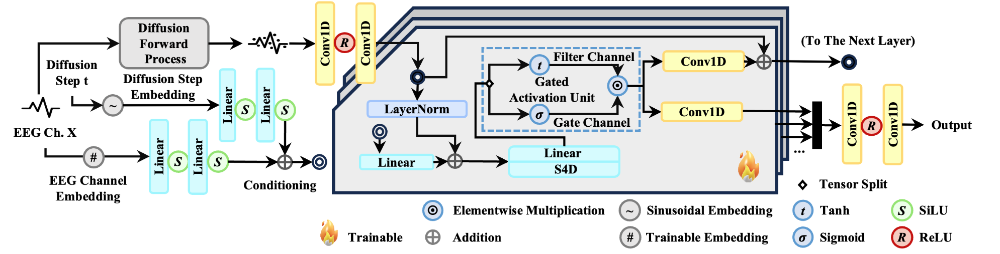
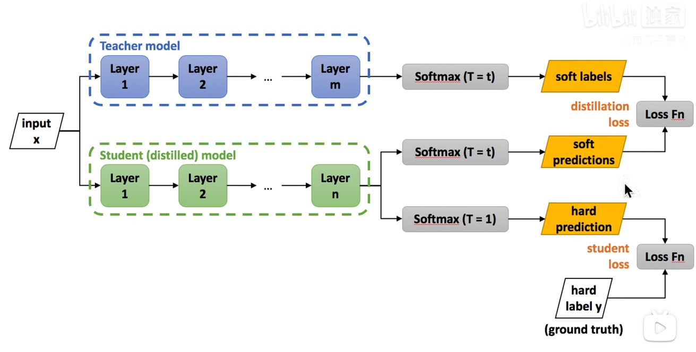
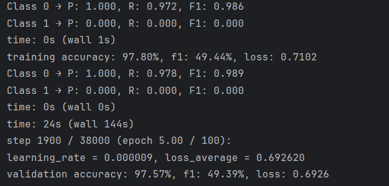
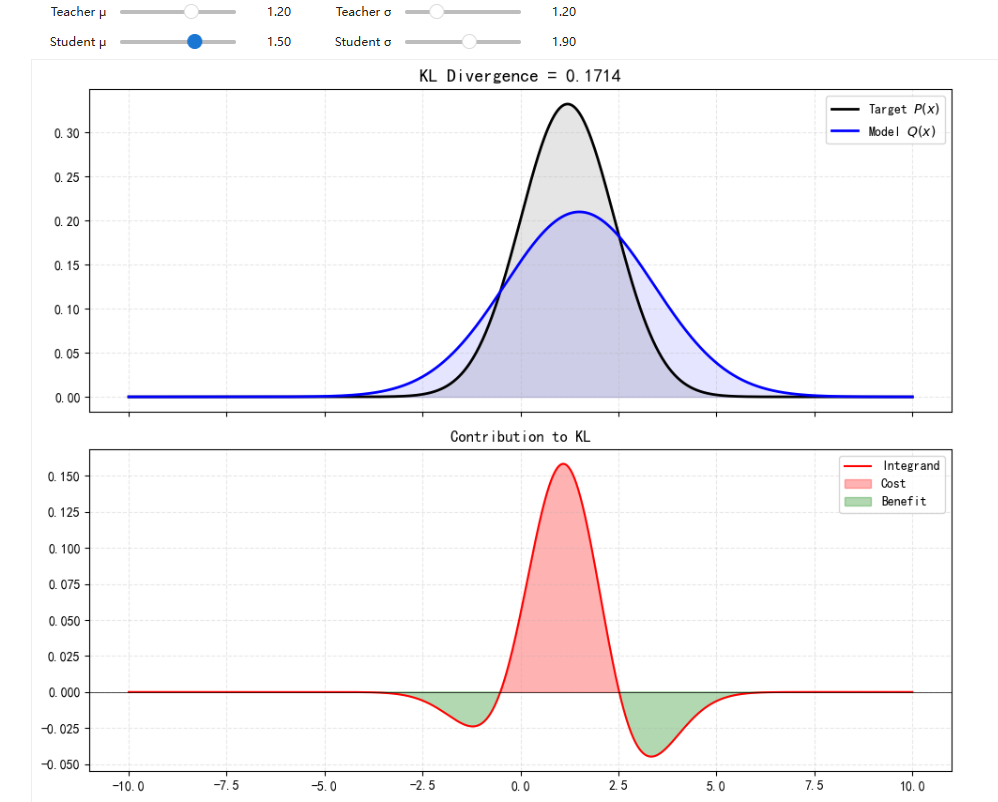
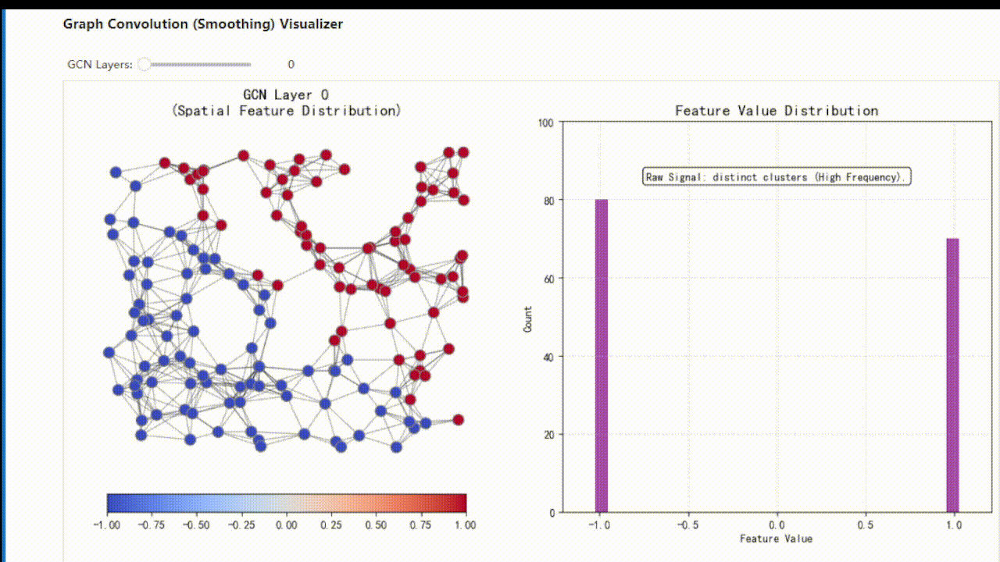

# 论文笔记

## 一、EEG综述类

### 1.A review of Graph Neural Networks for Electroencephalography data analysis（用于脑电图数据分析的图神经网络综述）Neuro computing 2023

本文章进行了汇总，可以作为引子，有几个方向的介绍，比如：癫痫、情绪、脑机接口、精神疾病。

对于精神疾病来说：引用文献《Classification of first-episode schizophrenia, chronic schizophrenia and healthy control based on brain network of mismatch negativity by graph neural network》展示了


 "CNN 的成功可归因于其分层结构, 这使它们能够从欧几里得域的数据中提取和整合多尺度特 征。非欧几里得域(例如社交网络、基因数据和脑网络) 中的数据可以通过图进行编码,这些图不仅包含量化元素, 还包含它们之间的关系。"

## 二、EEG无代码论文

### 1.EEGFormer: Towards Transferable and Interpretable Large-Scale EEG Foundation Model（EEGFormer:迈向可迁移且可解释的大规模脑电图基础模型）


对大量eeg进行预训练，对每个频段编码

## 三、EEG有代码论文

## 1.EEGDM: EEG Representation Learning via Generative Diffusion  Model（EEGDM:基于生成扩散模型的脑电图表示学习）



图 1. 所提出的用于表示学习的 SSMDP 的示意图。该模型通过预测扩散速度,基于扩散步嵌入和通道嵌入,学会了对噪声脑电图信号进行去噪和逆向处理。SSMDP 构建于 DiffWave 和 S4D 架构之上,并使用 DDPM 框架进行训练。随后,从门控或滤波通道中提取的潜在活动被用于下游分类。

## 四、计算机视觉有代码论文

## 五、计算机视觉无代码论文


## 图卷积知识


# 小技巧随记

### 1.GCN知识

标准图卷积网络（GCN）层（Kipf & Welling 2017）简化卷积

GCN 层通过对邻接矩阵的归一化，将消息聚合和特征转换合并在一个线性操作中。GCN 层的特征传播公式：$\mathbf{H}^{(l+1)} = \sigma \left( \tilde{\mathbf{D}}^{-\frac{1}{2}} \tilde{\mathbf{A}} \tilde{\mathbf{D}}^{-\frac{1}{2}} \mathbf{H}^{(l)} \mathbf{W}^{(l)} \right)$，其中**$H^{(l)} \in \mathbb{R}^{N \times F_{in}}$**：第 $l$ 层的节点特征矩阵。$N$ 是节点数，$F_{in}$ 是输入特征维度，**$W^{(l)} \in \mathbb{R}^{F_{in} \times F_{out}}$**：第 $l$ 层可学习的权重矩阵（线性变换），**$\tilde{A} = A + I_N$**：添加了自环（Self-loops）的邻接矩阵。为什么要加 $I_N$？如果不加自环，节点在更新时只聚合邻居的信息，而忽略了自身的特征。$\tilde{A}$ 确保了自身特征也参与下一次迭代，**$\tilde{D}_{ii} = \sum_j \tilde{A}_{ij}$**：$\tilde{A}$ 的度矩阵（Degree Matrix），是一个对角矩阵，**$\sigma(\cdot)$**：非线性激活函数，通常使用 $\text{ReLU}$。

前向传播：

**第一步**：特征变换 首先对节点特征进行线性投影：$Z^{(l)} = H^{(l)} W^{(l)}$维度变换$(N \times F_{in}) \times (F_{in} \times F_{out}) \rightarrow (N \times F_{out})$，物理意义：这一步类似于传统 CNN 中的 $1 \times 1$ 卷积或 MLP，旨在将特征映射到新的高维或低维空间，以提取更高阶的语义特征。 

**第二步**：图结构归一化与消息聚合这是GCN的灵魂所在。我们将变换后的特征 $Z^{(l)}$ 左乘归一化的邻接矩阵：$$\hat{A} = \tilde{D}^{-\frac{1}{2}} \tilde{A} \tilde{D}^{-\frac{1}{2}}$$，$$H_{agg} = \hat{A} Z^{(l)}$$对称归一化：$\hat{A}_{ij} = \frac{\tilde{A}_{ij}}{\sqrt{\tilde{d}_i \tilde{d}_j}}$。相比于随机游走归一化（$D^{-1}A$），对称归一化保持了矩阵的对称性，这对谱分析至关重要。物理意义：它在聚合邻居信息时，不仅考虑了节点 $i$ 自身的度（度大则权重低，避免hub节点过度支配），也考虑了邻居 $j$ 的度（邻居度大，说明该邻居的影响力被分散了，传给 $i$ 的权重也应降低）。消息传递：这一步实现了局部平滑，每个节点 $i$ 收集其一阶邻居（包括自己）的加权特征和。

第一步：图卷积的原始定义（谱域视角）

​	在图像中，卷积是利用固定大小的核在网格上滑动。但在图上，节点排列无序，无法直接“滑动”。 于是数学家利用**卷积定理**：$$f * g = \mathcal{F}^{-1} \big( \mathcal{F}(f) \cdot \mathcal{F}(g) \big)$$即：时域（空域）的卷积等于频域的乘积。要在图上做卷积，我们需要定义图的“傅里叶变换”。基底：图的拉普拉斯矩阵 $L = D - A$ 的特征向量矩阵 $U$ 就是图的傅里叶基。变换：图信号 $x$ 的傅里叶变换是 $\hat{x} = U^T x$。那么，**图卷积最初被定义为**：$$g_{\theta} \star x = U g_{\theta}(\Lambda) U^T x$$，其中：$x$ 是输入信号（节点特征）。$U$ 是拉普拉斯矩阵的特征向量。$g_{\theta}(\Lambda)$ 是卷积核（滤波器），是我们需要学习的对角矩阵参数。**痛点**：计算特征向量矩阵 $U$ 需要对 $L$ 进行特征分解，复杂度是 $O(N^3)$。对于大图，这根本不可行。

第二步：切比雪夫多项式近似

​	为了避免计算 $U$，学者们引入了**切比雪夫多项式**来近似那个卷积核 $g_{\theta}(\Lambda)$。原理是：任何函数都可以用多项式级数逼近。此时卷积变成了：$$g_{\theta'} \star x \approx \sum_{k=0}^K \theta'_k T_k(\tilde{L}) x$$​，$T_k$ 是 $k$ 阶切比雪夫多项式，$\tilde{L}$ 是归一化后的拉普拉斯矩阵。**K**：代表卷积核的大小，也就是感受野。$K=1$ 代表只看一阶邻居，$K=2$ 代表看二阶邻居。**好处**：不再需要特征分解，只需要算矩阵的幂 $L^k$，这就变成了局部操作，计算量大大降低。

第三步：Kipf & Welling 的“一阶近似” (GCN 2017)

​	Kipf 做了一个非常大胆的简化，把上面的切比雪夫近似推到了极致。1. 限制 K=1（一阶近似）Kipf 认为，我们不需要在单层里看得很远，只看一阶邻居（$K=1$）就够了，通过堆叠多层网络来扩大感受野。当 $K=1$ 时，公式简化为关于 $\tilde{L}$ 的线性函数：$$g_{\theta'} \star x \approx \theta'_0 x + \theta'_1 \tilde{L} x$$，参数共享与约束现在的公式里有两个参数 $\theta'_0$ 和 $\theta'_1$。为了防止过拟合和减少计算量，Kipf 强制令 $\theta'_0 = - \theta'_1 = \theta$。结合拉普拉斯矩阵的定义（$\tilde{L} = I - \tilde{D}^{-\frac{1}{2}}\tilde{A}\tilde{D}^{-\frac{1}{2}}$），推导过程如下：$$\begin{aligned} g \star x &\approx \theta(I) x - \theta(\tilde{L}) x \\ &= \theta(I - \tilde{L}) x \\ &= \theta \left( I - (I - \tilde{D}^{-\frac{1}{2}}\tilde{A}\tilde{D}^{-\frac{1}{2}}) \right) x \\ &= \theta \left( \tilde{D}^{-\frac{1}{2}}\tilde{A}\tilde{D}^{-\frac{1}{2}} \right) x \end{aligned}$$

看！这就出现了 $\tilde{D}^{-\frac{1}{2}}\tilde{A}\tilde{D}^{-\frac{1}{2}}$ 这个核心结构。Renormalization Trick (重归一化技巧)上面推导出的 $\tilde{A}$ 是原始邻接矩阵，对角线为0。如果不处理，直接乘这个矩阵，经过深层网络后，特征值的范围会使得数值不稳定（梯度爆炸或消失）。于是，Kipf 提出了 Renormalization Trick：直接用 $\tilde{A} = A + I$ （加了自环的邻接矩阵）来代替上面的结构。最终公式就诞生了：$$Z = \tilde{D}^{-\frac{1}{2}}\tilde{A}\tilde{D}^{-\frac{1}{2}} X W$$


### 2.对于ai的公式渲染失败

答：使用这个提示词 ，就可以正常渲染数学公式了

请你以标准 LaTeX 格式输出数学公式，具体要求如下：

1. 使用标准 LaTeX 语法，不要使用任何非标准标记（如 标签）。

2. 如果是行内公式，请用单个美元符号 $ 包裹公式。

3. 如果是独立公式块，请用双美元符号 $$ 包裹公式，并将公式居中显示。

4. 确保公式中的符号、运算符、上下标和括号等符合 LaTeX 语法规范。

5. 公式应清晰、简洁，尽量避免使用模糊或不明确的符号。

6. 根据公式的复杂度，决定使用行内公式还是独立公式块。

7. 如果需要，可以为公式添加简短的注释或说明。

   

### 3.模块缝合问题

对于这个问题

```python
    def forward(self, x):
        x1 = self.in_conv(x)
        x2 = self.down1(x1)
        x2 = self.lsk(x2)
        x3 = self.down2(x2)
        print("x3",x3.shape)
        x3 = to_3d(x3)
        print("x3",x3.shape)
        x3 = self.mv(x3)
        x3 = to_4d(x3,16,16)#这里🔎to_3d要加入两个参数  to_4d(x3,16,16)后面两个16是原始数据的h和w
        # x = x.permute(0, 2, 3, 1)  # 【B, C, H, W】 -> 【B, H, W, C】🔎这个地方尺寸问题 很重要
        # x= x.permute(0, 3, 1, 2)  # 【B, H, W, C】 -> 【B, C, H, W】
        x3 = x3.permute(0, 2, 3, 1)
        x3 = self.md(x3)
        x3 = x3.permute(0, 3, 1, 2)
        x4 = self.down3(x3)
        x5 = self.down4(x4)
        x = self.up1(x5, x4)
        x = self.up2(x, x3)
        x = self.up3(x, x2)
        x = self.up4(x, x1)
        x = self.out_conv(x)
        return x
# 输入 B C H W,  输出 B C H W
if __name__ == '__main__':
    block = UNet()
    input = torch.rand(3, 1, 64, 64)
    output = block(input)
    print(input.size(), output.size())

```

记得print("符号：",x.shape)，接下来就是bhwc这种尺寸问题：batch：0（有的时候是N），channel：1，height：2，width：3   👉(B/N,C,H,W)

### 4.读文献

方法论：

本质：看论文本身不是目的，而是**手段**，主要看他怎么解决这个问题，用什么思路和角度  

Why-为什么要做这个研究？关注点： **Introduction** 中会阐述**本项研究的重大意义**、要解决什么工程难题或揭示什么物理机制？解决问题的紧迫性等内容。

What-研究发现了什么，**得出了什么结论？**关注点： **摘要中会直接体现最核心的结论**，对于某问题有什么新的认识？提出了什么新的研究方法？得到了什么新的研究结论？先看摘要，由于摘要篇幅受限，更具体的结论可到 Conclusion 或 discussion 中查看。

How-研究是如何实施的，用了什么方法/技术？关注点：这部分属于较为具体、细致的内容，研究的实施过程就是论文的主体内容。对于试验类论文，包括试验目的与思路、试验设备与材料准备、试验方法与步骤、试验现象、试验结果、试验机理揭示等。对于**数值计算类**论文，包括工程背景介绍、数值模型（本构、参数、标定方法）、试验/实测/理论验证、数值计算工况、计算结果分析、工程问题机理揭示等。对于**理论推导类论文**，包括理论简介、理论推导、试验/实测/数值模拟验证、算例分析、参数分析等。

通过这三个问题，推出最终目的科研 Ideas，即这篇文献有哪些不足？ 你可以在哪些方面进行创新？ 可表示为WWH→Ideas。

### 5.创新点

方法论：

找创新点主要在于文献顶刊，发现文章缺陷，在什么地方还有可以改进的方向。**文献的不足之处主要有**：对于 XX 问题少有研究；针对 XX 问题或工况，缺乏有效可行的分析评价方法；仅阐述试验现象，未揭示现象背后的物理机制，未总结出有效的预测方法；缺乏实测验证；理论假设不合理；理论推导不严密；数值计算参数过多且难以标定；计算效率过低；计算误差较大；试验结果不足以支撑得出现有结论等。  

科研创新性排序：**新问题新方法（top期刊成果）>老问题新方法（top、主流期刊成果）>新问题老方法（主流期刊成果）>老问题老方法**

### 6.打印模型细节

实例化模型

```python
if __name__=='__main__':
	vit = VisionTransformer()
	print(vit)
```

### 7.python基础

__是强制私有       _就是明确私有外部也可以调用

```python
# 定义一个类（蓝图）
class Dog:
    # __init__ 是构造函数，在实例化时自动调用
    # self 代表实例本身
    def __init__(self, name, breed):
        # 给实例添加属性
        self.name = name
        self.breed = breed

    # 给实例添加方法
    def bark(self):
        print(f"{self.name} 汪汪叫！")

# --- 实例化过程 ---
# 根据 Dog 类，创建一个名为 "旺财" 的实例
my_dog = Dog("旺财", "中华田园犬")

# my_dog 就是一个实例，它拥有 name 和 breed 属性，以及 bark 方法
print(my_dog.name)  # 输出: 旺财
print(my_dog.breed) # 输出: 中华田园犬
my_dog.bark()       # 输出: 旺财 汪汪叫！
```

### 8.BrainNet Viewer 10-20通道 node文件

-21.5	66.9	12.1	1	1	Fp1
24.3	66.3	12.5	1	1	Fp2
-39.7	25.3	44.7	2	1	F3
41.9	27.5	43.9	2	1	F4
-49.1	-20.7	53.2	3	1	C3
50.3	-18.8	53.0	3	1	C4
-41.4	-67.8	42.4	5	1	P3
44.2	-65.8	42.7	5	1	P4
-25.8	-93.3	7.7	6	1	O1
25.0	-95.2	6.2	6	1	O2
-52.1	28.6	3.8	2	1	F7
53.2	28.4	-3.1	2	1	F8
-65.8	-17.8	-2.9	4	1	T7
67.4	-18.5	-3.4	4	1	T8
-55.9	-64.8	0.0	4	1	P7
56.4	-64.4	0.1	4	1	P8
0.0	26.8	60.6	2	1	Fz
0.8	-21.9	77.4	3	1	Cz
0.7	-69.3	56.9	5	1	Pz
-62.8	-46.6	-14.66	4	1	TP9
62.8	-46.58	-14.6	4	1	TP10  

### 9.Diffusion知识


$q(x_t|x_{t-1})$ 这个表明他是在前一项的基础上加噪声所以是条件概率（马尔可夫性我们只需要知道它紧邻的上一步 $x_{t-1}$ 就足够了。**我们不需要知道 $x_0, x_1, \dots, x_{t-2}$ 是什么样子的**），选择高斯噪声原因是两个独立高斯分布随机变量相加，结果仍然服从高斯分布，

$z \sim \mathcal{N}(\mu, \sigma^2)$代表定义了一个随机变量z，它服从一个一般正态分布（高斯分布)。这个分布均值（中心位置是$\mu$)，方差（离散程度是$\sigma^2$)，$\frac{z - \mu}{\sigma} \sim \mathcal{N}(0, I)$这是一个标准化过程，如果我们把变量 $z$ 减去它的均值 $\mu$，再除以它的标准差 $\sigma$，得到的新变量就会服从标准正态分布。标准正态分布是最简单的高斯分布，其均值为 0，方差为 1（或者在**多维情况下为单位矩阵 $I$**)**这种变换后的变量常被称为 Z-score。**

$z = \mu + \sigma \cdot \epsilon$    和  $\epsilon \sim \mathcal{N}(0, I)$ 这两行是逆操作，也是重参数化技巧核心，引入服从标准正态分布的辅助噪声变量$\epsilon$

任意一个复杂的正态分布变量 $z$，都可以看作是由一个确定的均值部分 $\mu$，加上一个被标准差 $\sigma$ 缩放过的标准噪声 $\epsilon$ 组合而成的。

**$x_t = \sqrt{\alpha_t} x_{t-1} + \sqrt{1-\alpha_t} \epsilon_{t-1}$** 这里的均值 $\mu$ 是 $\sqrt{\alpha_t}x_{t-1}$，这里的方差 $\sigma^2$ 是 $1-\alpha_t$，所以标准差 $\sigma$ 是 $\sqrt{1-\alpha_t}$

### 10.深度学习路线

李沐--吴恩达---李宏毅--爆肝杰哥（入门）--邱锡鹏--小土堆（入门）--shuhuai008（硬核手推）--

### 11.知识蒸馏




知识蒸馏算法原理+综述


**第一个方向是把一个已经训练好的臃肿的网络进行瘦身**

权值量化：把模型的权重从原来的32个比特数变成用int8，8个比特数来表示，节省内存，加速运算

剪枝：去掉多余枝干，保留有用枝干。分为权重剪枝和通道剪枝，也叫结构化剪枝和非结构化剪枝，一根树杈一根树杈的剪叫非结构化剪枝，也可以整层整层的剪叫结构化剪枝。

**第二个方向是在设计时就考虑哪些算子哪些设计是轻量化的**

**第三个方向是在数值运算的角度来加速各种算子的运算**

比如im2col+GEMM，就是把卷积操作转成矩阵操作，矩阵操作是很多算法库里内置的功能，比如py，tf和matlab都有底层的加速到极致的矩阵运算的算子

**知识的表示与迁移**


把左边的马图像喂给分类模型，会有很多类别，每个类别识别出一个概率，训练网络时，我们只会告诉网络，这张图片是马，其余是驴是汽车的概率都是0，这个就是hard targets，用hard targets训练网络，但这就相当于告诉网络，这就是一匹马，不是驴不是车，而且不是驴不是车的概率是相等的，这是不科学的。若是把马的图片喂给已经训练好的网络里面，网络给出soft targets这个结果，是马的概率为0.7，为驴的概率为0.25，为车的概率是0.05，所以soft targets就传递了更多的信息


所以训练教师网络的时候就可以用hard targets训练，训练出了教师网络之后，教师网络对这张图片的预测结果soft targets能够传递更多的信息，就可以用soft targets去训练学生网络

**总结**

Soft Label包含了更多“知识”和“信息，像谁,不像谁,有多像,有多不像，特别是非正确类别概率的相对大小(驴和车)

引入蒸馏温度T，把原来比较硬的soft targets变的更软，更软的soft targets去训练学生网络，那些非正确类别概率的信息就暴露的越彻底，相对大小的知识就暴露出来，让学生网络去学


T为1，就是原softmax函数，softmax本来就是把每个类别的logic强行变成0-1之间的概率，并且求和为1，是有放大差异的功能，如果logic高一点点，经过softmax，都会变的很高。

T越小，非正确类别的概率相对大小的信息就会暴露的更明显；T越大，曲线就会变得更soft，高的概率给降低，低的概率会变高，贫富差距就没有了。

**举个例子：**

**左侧**学生网络是个神经网络，四个类别有一个线性分类层，猫的类别给出的分数logit为-5，狗的类别给出的分数logit为2，驴的类别给出的分数logit为7，马的类别给出的分数logit为9

原来的softmax在图中是当T=1时的计算，从计算结果可以看出，有不同数量级，贫富差异较大；

当T=3时，得到的分布就更软了，基本是同一个数量级。但是还是几个数值均分布在0-1之间且和为1

**右侧**教师网络也是


知识蒸馏的过程


首先有一个已经训练好的教师网络（Teacher model），把很多数据（input）喂给教师网络，教师网络会给每个数据都给一个温度为T的时候的softmax（文中soft labels）；同时把数据（input）喂给学生网络（student model），也给学生网络一个温度T获得softmax（文中soft predictions），对soft labels和soft predictions做一个损失函数L（distillation loss也叫soft loss），让他们两个越接近越好，解释就是学生在模拟老师的预测结果；学生网络经过一个T=1的普通的softmax（文中的hard prediction）和hard label再做一个损失函数（student loss也叫hard loss），让他们两个越接近越好。所以这个学生网络既要在温度为T的预测结果和教师网络的预测结果尽可能接近，又要在温度为1的预测结果和标准答案更可能接近。


计算hard loss：学生网络和hard label之间的传统交叉熵为-log（0.88）

计算soft loss：如图

将两个损失函数求和，作为最终学生网络的损失函数，去训练学生网络

知识蒸馏有一个附带的效果：假如用没有3的minist手写数据集去训练学生网络，但是训练教师网络的时候是用的所有类别去训练的，教师网络也会将3的知识迁移给学生网络，虽然学生网络从来没见过3这个类别样本，但是最终学生网络也能预测3。

### 12.准确率陷阱



注意力陷阱模型只学习一个样本类别，放弃另一个样本类别

**本质**：你的模型**根本没有学习**。它找到了一个“偷懒”的全局最优解——**把所有样本都预测为 Class 0（负样本/Normal）**。

**数据推断**：根据 `Class 0 R: 0.967` 和 `Class 1 R: 0.000`，可以反推你的数据集中，**Class 0 占比约为 97%，而 Class 1（MCI）占比仅为 3% 左右**。

### 13.kl散度可视化操作（ipywidgets）

KL 散度 (Forward KL) 的连续形式定义如下：

$$D_{KL}(P || Q) = \int_{-\infty}^{\infty} \underbrace{P(x)}_{\text{权重}} \cdot \underbrace{\log \left( \frac{P(x)}{Q(x)} \right)}_{\text{对数比 (Log-Ratio)}} dx$$

为了与图像对应，我们将被积函数定义为 **“局部 KL 贡献密度” (Local Contribution)**，记为 $f(x)$：

$$f(x) = P(x) \cdot [\log P(x) - \log Q(x)]$$

您在下方子图中看到的红色和绿色曲线，画的就是 $y = f(x)$。

**区域颜色****积分符号概率关系数学本质 (Log Ratio)物理直觉

红色 (Cost)**$(+)$ 正值$P(x) > Q(x)$$\log(P/Q) > 0$**欠拟合 (Under-estimation)**老师讲了重点，学生没记住。

**绿色 (Benefit)**$(-)$ 负值$P(x) < Q(x)$$\log(P/Q) < 0$**过拟合 (Over-estimation)**老师没讲的废话，学生背了一堆。



### 13.ipywidgets

要在shell先启动环境在激活notebook，输出图像时候要记得定高。


